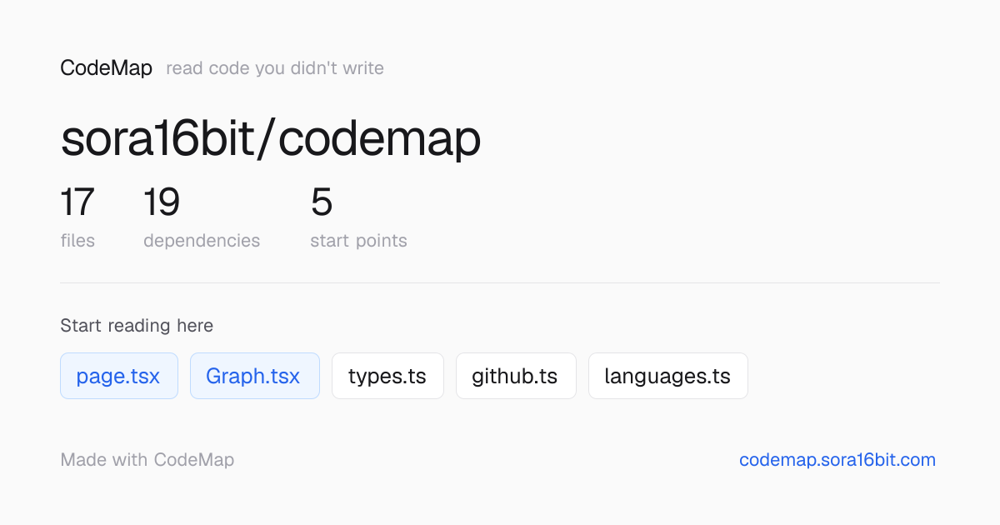

<div align="center">

# CodeMap

### Jogue um repositório do GitHub nele. Receba um mapa de *como* lê-lo.

Uma ferramenta gratuita e sem IA que transforma qualquer repositório público em um mapa de dependências — e diz **por onde começar a ler**.

**[▶ Experimente online em codemap.sora16bit.com](https://codemap.sora16bit.com)**

[](https://codemap.sora16bit.com)
[](../LICENSE)
[](https://nextjs.org)
[](#contribuir)
[](#linguagens-suportadas)

[English](../README.md) · [日本語](README.ja.md) · [简体中文](README.zh-CN.md) · [Español](README.es.md) · [Français](README.fr.md) · [Deutsch](README.de.md) · Português · [한국어](README.ko.md)

<!-- Imagem principal: CodeMap analisando o próprio código (dogfooding). Salva em docs/assets/self.png -->


<sub>*Esquerda: o mapa de dependências — arquivos agrupados em caixas coloridas por pasta. Direita: por onde começar — pontos de entrada, fundações e folhas, ordenados automaticamente. Acima: CodeMap lendo o próprio código.*</sub>

</div>

---

## Índice

- [O problema](#o-problema)
- [O que o CodeMap faz](#o-que-o-codemap-faz)
- [Início rápido](#início-rápido)
- [Como funciona](#como-funciona)
- [Linguagens suportadas](#linguagens-suportadas)
- [Status e roadmap](#status-e-roadmap)
- [Contribuir](#contribuir)
- [Licença](#licença)

## O problema

Você abre um repositório desconhecido para aprender com ele. Diante de centenas de arquivos, sem ideia de por onde começar. As ferramentas que existem deixam, cada uma, uma lacuna:

- **As ferramentas de chat com IA** (Cursor, Claude Code, DeepWiki) respondem sobre um *ponto* do código, mas **não há mapa**. Você só aprende o que perguntou, e o panorama completo nunca se monta na sua cabeça.
- **As ferramentas de visualização** (Sourcegraph, Madge) dão um mapa, mas são **apenas linhas**. Não dizem o que cada arquivo faz nem por onde começar.

Então você trava: pode perguntar sobre as árvores ou olhar a floresta, mas nada lhe entrega a **trilha**.

## O que o CodeMap faz

A IA de uso geral **responde às suas perguntas**. O CodeMap **desenha o mapa do projeto inteiro — e aponta o ponto de partida.**

Cole a URL de um repo público do GitHub. O CodeMap analisa o código e te dá:

- **🗺️ Um mapa de dependências** — qual arquivo importa qual, como diagrama interativo. Os arquivos são agrupados em caixas coloridas por pasta, e o formato da base de código fica visível num relance.
- **📍 Por onde começar** — cada arquivo é classificado em **pontos de entrada** (onde a execução começa), **bases** (das quais muitos dependem — entenda-os para captar o todo) e **folhas** (isolados, ler depois). É assim que desenvolvedores experientes leem código desconhecido: não da linha 1 ao fim, mas visão geral → entrada → núcleo, sem ler tudo.
- **🏷️ O que cada arquivo provavelmente é** — um papel de uma palavra deduzido do nome e do caminho (`Definições de tipos`, `Roteamento`, `Lógica central`…), com zero IA e zero alucinação. Quando não consegue saber, fica em silêncio em vez de adivinhar errado.
- **📖 O código real** — clique em qualquer arquivo para ler seu código em tela cheia, com o mapa e as dependências ao lado para você não perder o lugar.

Tudo isso é construído **mecanicamente — sem IA, sem chave de API, gratuito e rápido.** A IA fica reservada para uma futura camada opcional de explicação, com sua própria chave de API (BYOK).

A interface está disponível em **8 idiomas** (English, 日本語, 简体中文, Español, Français, Deutsch, Português, 한국어).

## Início rápido

O jeito mais rápido é a **[demo ao vivo](https://codemap.sora16bit.com)** (sem instalar). Cole um repo (`owner/repo` ou uma URL completa `github.com/...`) e clique em **Analisar**. Experimente `sindresorhus/ky` ou `cli/cli` para vê-lo em uma base de código real.

Para rodar localmente (Node.js 20+):

```bash
git clone https://github.com/sora16bit/codemap.git
cd codemap
npm install
npm run dev
```

Depois abra <http://localhost:3000>.

## Como funciona

```
Repo do GitHub ──tar.gz (codeload, sem auth)──▶ extrair arquivos-fonte
                                                     │
                                                     ▼
                           src/lib/analyze.ts  (despachante de linguagens)
                            ├─ JS/TS  → ts-morph (imports AST precisos)
                            ├─ Python → resolvedor regex
                            └─ Go/Rust → resolvedor regex
                                                     │
                                                     ▼
                grafo de dependências ──▶ diagrama React Flow + guia de leitura
```

- **Frontend:** Next.js 16 (App Router), React Flow (`@xyflow/react`), Tailwind CSS v4
- **Obtenção:** repos públicos são baixados como tarball do codeload (sem auth), arquivos-fonte extraídos
- **Análise:** `src/lib/analyze.ts` despacha por linguagem; as extensões suportadas ficam em `src/lib/languages.ts` (`SOURCE_EXT`) — adicionar uma linguagem começa aqui
- **Guia de leitura:** `src/lib/reading-guide.ts` deriva entrada/base/folha apenas das contagens de import — sem IA

## Linguagens suportadas

| Linguagem | Análise de dependências | Mapa · guia de leitura · dicas de papel |
|---|---|---|
| JavaScript / TypeScript | ✅ AST (ts-morph) | ✅ |
| Python | ✅ regex | ✅ |
| Go | ✅ regex (ciente do module) | ✅ |
| Rust | ✅ regex (`mod` / `use crate::`) | ✅ |
| Outras (Java, C/C++, Ruby…) | — obtidas e mapeadas | ✅ (sem linhas de import) |

## Status e roadmap

> ⚠️ **Inicial mas utilizável.** A camada gratuita de "ler um repo" funciona hoje. As camadas de explicação com IA são a próxima fase.

| Funcionalidade | Estado |
|---|---|
| Mapa de dependências com agrupamento por pasta | ✅ Lançado |
| Guia de "por onde começar" (entrada / base / folha) | ✅ Lançado |
| Dicas de papel de arquivo (sem IA) | ✅ Lançado |
| Leitor de código em tela cheia com navegação de mapa/deps | ✅ Lançado |
| Interface em 8 idiomas | ✅ Lançado |
| Resumos de papel de arquivo — o que faz, em uma linha (IA) | 🔜 Planejado (BYOK) |
| Explicação linha por linha para iniciantes — "o que quebra se você apagar esta linha" (IA) | 🔜 Planejado (BYOK) |

As camadas de IA serão **ancoradas em fatos da AST** (onde um símbolo é definido/usado, para onde um import resolve) para que as explicações não aluciném — crucial para uma ferramenta voltada a quem aprende.

## Contribuir

Issues e PRs são bem-vindos. Uma ótima primeira contribuição é **adicionar uma linguagem**: estenda `SOURCE_EXT` e o despachante em `src/lib/languages.ts` (Python/Go/Rust são exemplos baseados em regex a seguir).

## Licença

[MIT](../LICENSE)
